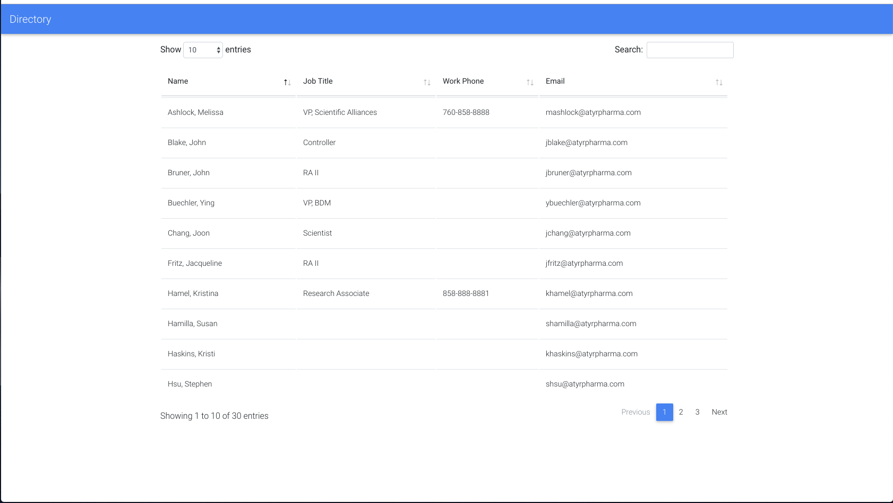
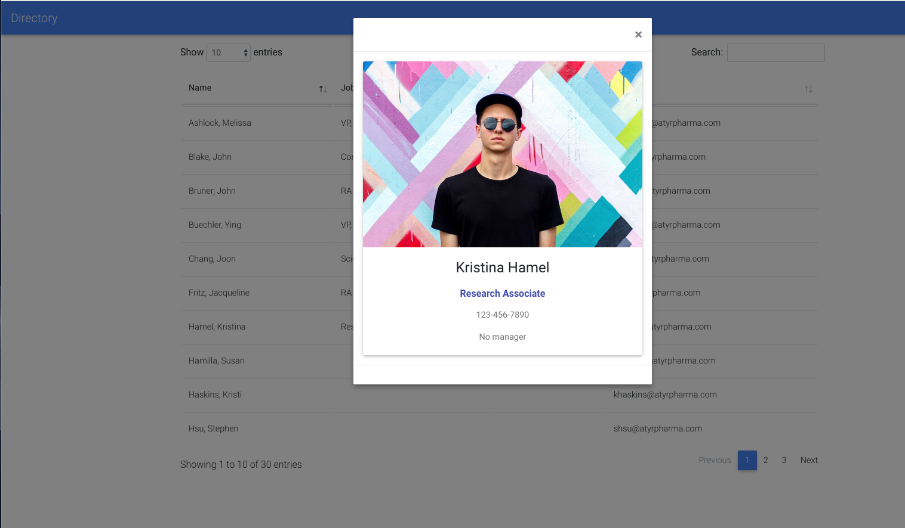

# Gsuite Directory Application

## About
This is a directory web app specifically for Gsuite.

## Getting Started
You will need:
* Gsuite domain with API access enabled
* Domain admin account

If you don't have any of these follow the instructions <a href="https://developers.google.com/admin-sdk/directory/v1/quickstart/python">here</a>.

## Installation
Install dependencies using pip:

`pip install -r requirements.txt`


## Usage
The application can be started by
* Unix, Linux, Mac
```
export FLASK_APP=main.py
flask run
```
* Windows
```
set FLASK_APP=hello
flask run
```
Application will run at 127.0.0.1:5000

## Screenshots
### List View

### User View

